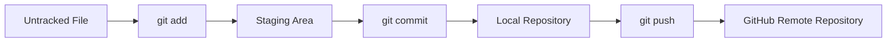

# 🚀 Git & GitHub Mastery Repository

---

## 📌 Overview

**Devboard Git Learning Repository** is a structured hands-on project designed to master:

- 🧠 Git fundamentals
- 🌿 Branching strategies
- 🔀 Merging & conflict resolution
- 🔄 Advanced Git workflows
- ⚡ GitHub CLI automation
- 🚀 Real-world DevOps version control practices

---

## 🎯 Purpose

This repository is built to simulate real-world DevOps workflows and strengthen professional Git skills for CI/CD and collaboration environments.

---

## 🧰 Tech Stack

- 🐙 Git
- 💻 GitHub
- 🖥️ GitHub CLI (`gh`)
- 🐧 Linux Terminal
- 🧑‍💻 VS Code

---

---

## 📘 Learning Modules

### 🔹 Git Basics
- git add
- git commit
- git status
- git log
- git diff
- git config

---

### 🌿 Branching & Collaboration
- Create & switch branches
- Merge workflows
- Fast-forward merge
- Resolve merge conflicts

---

### ⚡ Advanced Git Operations
- Rebase workflows
- Squash commits
- Stashing changes
- Cherry-picking commits

---

### 🔁 Reset vs Revert
- Soft reset
- Mixed reset
- Hard reset
- Safe revert strategy

---

### 🖥️ GitHub CLI Mastery
- Repository creation
- Issue tracking
- Pull request workflows
- GitHub Actions monitoring
- Releases & API usage

---

## 📊 Git Workflow Diagram

⚙️ Example Workflow

# Create a file
echo "Hello Git" > hello.txt

# Stage changes
git add hello.txt

# Commit changes
git commit -m "Add hello file"

# Push to GitHub
git push origin master

🧠 Key Concepts Practiced
Branch-based development 🌿
Merge conflict resolution ⚔️
Commit history management 📜
Safe rollback strategies 🔄
Distributed collaboration 🌍
CI/CD-ready Git workflows 🚀

👨‍💻 Author

Abusufiyan Khan
🚀 DevOps & Cloud Enthusiast
🐙 Git | ☁️ Cloud | ⚙️ CI/CD Learner

📈 Project Goals
Build strong Git fundamentals
Simulate real-world DevOps workflows
Prepare for CI/CD pipelines
Improve collaboration skills in teams
